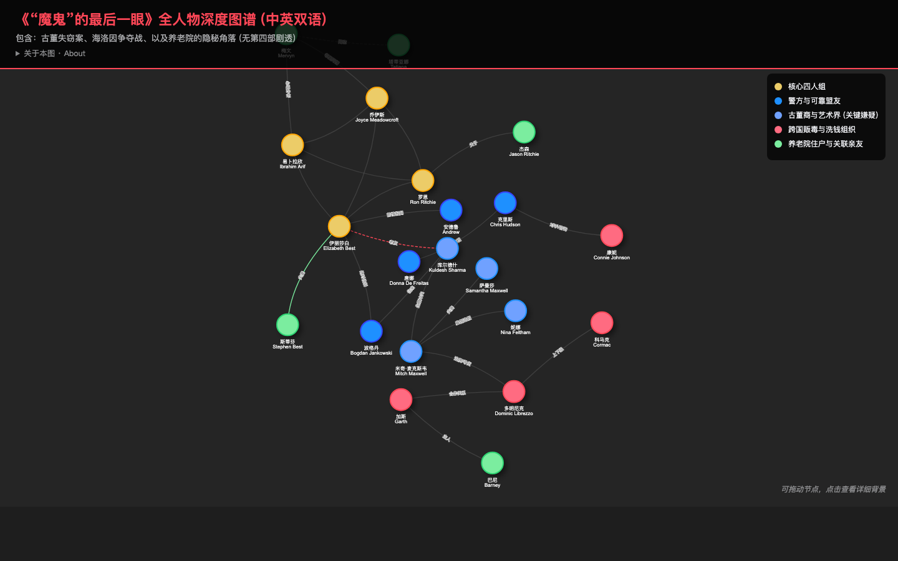

[English](README.md) | **中文**

# 周四推理俱乐部第四部人物图谱（中英双语 · 无剧透）

理查德·奥斯曼（Richard Osman）“周四推理俱乐部”（*The Thursday Murder Club*）系列第四部《*The Last Devil to Die*》的交互式人物关系图谱。中英双语标注，**不含第四部核心剧透**，适合阅读时随手查阅。

**在线访问：<https://tmc.snownamida.top/>**



## 功能

- **五大阵营分色**：核心四人组、警方与盟友、古董商与艺术界、贩毒组织、养老院众人
- **交互式网络图**：拖动节点整理布局，滚轮 / 双指缩放平移
- **人物详情卡**：点击节点查看人物的中英双语背景介绍
- **关系标注**：连线标注人物之间的关系（老友、夫妻、上下级……）
- **移动端适配**：手机上同样可以流畅浏览

## 本地开发

纯静态单文件页面，无需构建：

```bash
# 任选一种方式在本地打开
open index.html
# 或
python3 -m http.server 8000
```

技术栈：[vis-network](https://visjs.github.io/vis-network/docs/network/)（CDN 引入）。

部署：GitHub Pages + 自定义域名（见 `CNAME`）。

## 相关项目

- [罗杰疑案人物关系图（无剧透）](https://roger-ackroyd-map.vercel.app/) — 阿加莎·克里斯蒂《The Murder of Roger Ackroyd》

## 支持

如果这个小工具对你的阅读有帮助，欢迎 [☕ 请我喝咖啡](https://ko-fi.com/snownamida)。

## 许可证

[MIT](LICENSE) © Snownamida
